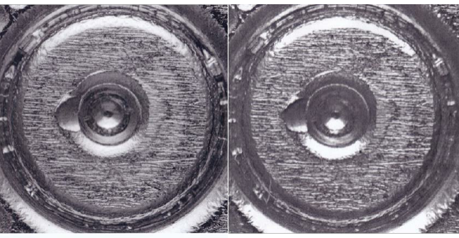
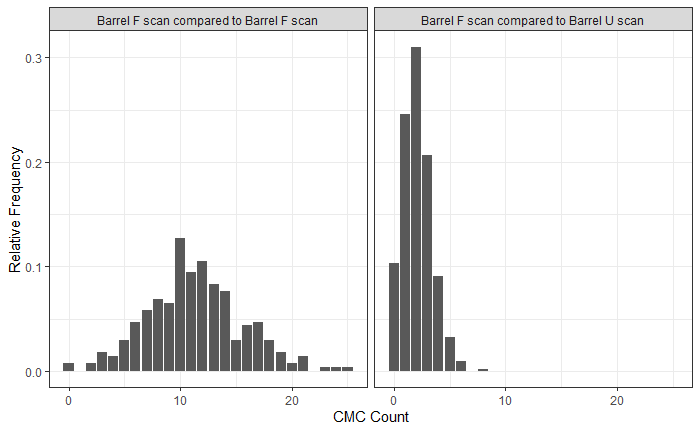
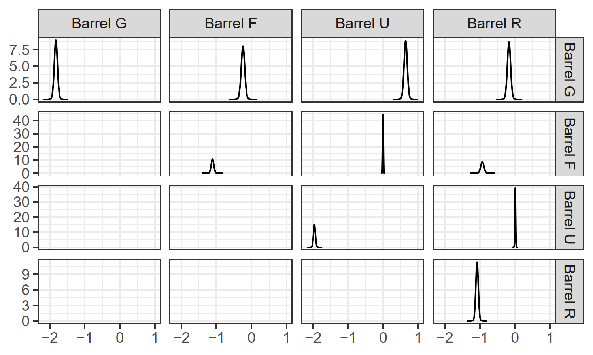
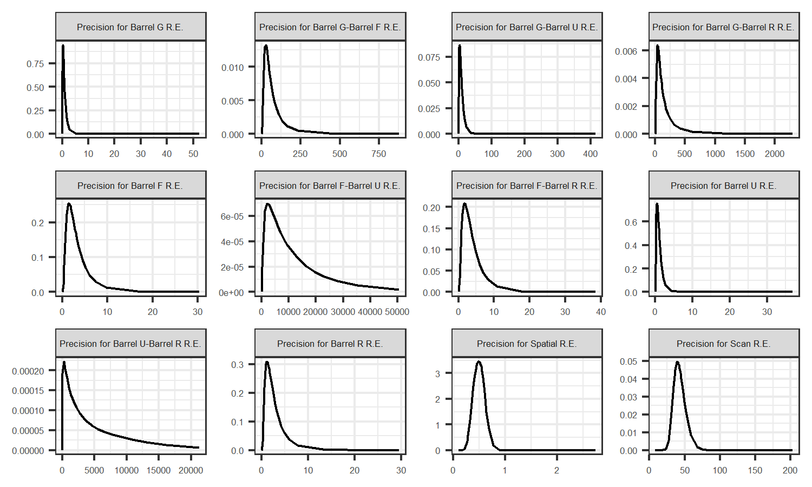
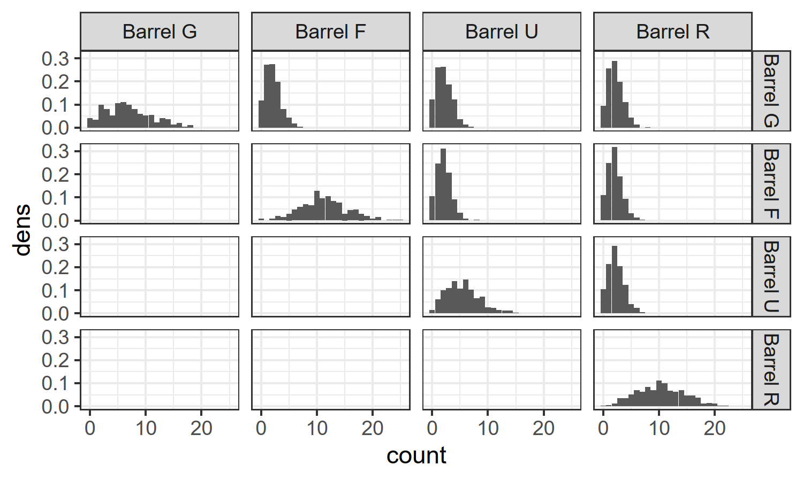

```{r global.options,include = FALSE}
knitr::opts_chunk$set(fig.align = "center",echo = FALSE,warning = FALSE,message = FALSE,fig.pos = "htbp")
```

# Outline

- Introduction

- Data

- Methods

- Results

- Conclusion & Future Work

Slides are available here: [https://jzemmels.github.io/stat615_project/](https://jzemmels.github.io/stat615_project/)

---

class: inverse, center, middle

# Introduction

<!-- --- -->

<!-- # Cartridge Cases & Breech Face Impressions -->

<!-- - *Cartridge case* is a bullet casing -->

<!-- - During firing, the cartridge case slams against back wall of the barrel -->

<!--   - "Back wall" is called the *breech face* -->

<!-- -- -->

<!-- - Markings on the breech face "stamp" into the cartridge case -->

<!--   - Markings are called *breech face impressions* -->

<!--   - Considered as the barrel leaving its "fingerprint" on the cartridge case -->

<!-- -- -->

<!-- - Forensic examiners use breech face impressions to determine whether two cartridges match -->

<!--   - "Match" means they were fired from the same barrel -->

---

# Cartridge Cases & Breech Face Impressions

```{r}

```

<!-- The figure shows two cartridges cases. -->
<!-- Take note of the striated markings on both cartridge cases. -->
<!-- Examiners would study the markings to determine whether the two cartridge cases match -->
<!-- Until recently, there has not been a method to quantitatively measure the similarity between two cartridge cases. -->

<!-- 1.3 -->

<!-- Attempt 2: 1 -->

---

# Congruent Matching Cells (CMC) Algorithm

```{r}
knitr::include_graphics("images/kmOriginalMethod_combined.png",dpi = 250)
```

Partition two cartridge case scans into a grid of cells

--

Each cell is classified as a "Congruent Matching Cell" (CMC) or a "non-CMC"

Measure the pair's similarity as the total number of CMCs, the *CMC count*

--

Truly matching cartridge case pairs should have a large CMC count


<!-- 1 -->

<!-- Attempt 2: 0.8 -->

---

# CMC Method Error Rate

```{r}
knitr::include_graphics("images/cmcDistributionFakeExample_edited.png",dpi = 250)
```

In practice, we don't know whether two cartridge cases truly match.

--

We use a CMC count decision boundary to classify matches or non-matches

- E.g., a CMC count greater than or equal to $6$ implies that a pair is a match

--

For a decision boundary, what proportion of pairs will be misclassified?

**Can we obtain a model-based estimate for the CMC method error rate?**

<!-- 1 -->

<!-- Attempt 2: .9 -->

---

class: inverse, center, middle

# Data

---

# Pairwise Comparison CMC Data

$102$ cartridge cases fired from $4$ barrels: $G, F, U,$ and $R$

- $\binom{102}{2} = 5151$ total pairwise comparisons

- $1254$ known match comparisons, $3897$ known non-match comparisons

--

Using an $8 \times 8$ grid of cells, CMC counts were obtained for each pair

- $5151*64 = 329664$ total observations

- Each observation is a $1$ (CMC), $0$ (non-CMC), or `NA` (not considered)

```{r,echo=FALSE,message=FALSE,warning=FALSE}
library(tidyverse)
tibble::tibble(`Cell Index` = c("1, 1","1, 2","1, 3","1, 4","..."),
           `CMC Classif.` = c("NA","1","0","1","...")) %>%
  knitr::kable()
```


<!-- 1 -->

<!-- 0.75 -->

---

# Example: Barrel F CMC Counts

```{r}

```

<!-- .3 -->

<!-- Attempt 2: 0.5 -->

---

class: inverse, center, middle

# Methods

---


```{r}
knitr::include_graphics("images/gmrf_dependencyDiagram.png",dpi = 150)
```

<!-- 1.75 -->

<!-- Attempt 2: 1.5 -->

<!-- --- -->

<!-- # Random-Effects Markov Random Field Model -->

<!-- Model observation associated with a single cell as Bernoulli -->

<!-- - Use GLM structure for the "success" probability -->

<!-- - Incorporate barrel-level and scan-level repeated measure effect -->

<!-- - Incorporate neighboring scan spatial effect as Markov Random Field -->

---

Index scans $i,j = 1,...,102$. 
<!-- Define set of barrels $\pmb{B} = \{G,F,U,R\}$. -->

- Denote $i,j$ as comparison between scan $i$ and scan $j$

<!-- - Define $b(\cdot)$ as function mapping a scan to its barrel of origin -->

- Use row and column indexing for each cell: $[r,c]$, $r,c = 1,...,8$

- E.g., $y_{i,j,[r,c]}$ is $[r,c]$th observation from comparison $i,j$

--

Assume $y_{i,j,[r,c]} | p_{i,j,[r,c]} \overset{ind}{\sim} Bern(p_{i,j,[r,c]})$ where

\begin{align*}
\text{logit}(p_{i,j,[r,c]}) =  &\underbrace{\sum_{A \in \{G,F,U,R\}} \beta_A \cdot I\left(\text{scan } i \text{ or scan } j \text { originated from barrel } A\right)}_{\text{Barrel-level Random Effect}} \\
& + \underbrace{\sum_{...} \gamma_{AC} \cdot I\left(\text{barrel } A \text{ scan is compared to barrel } C \text{ scan}\right)}_{\text{Barrel-level Interaction}} \\
& + \underbrace{\kappa_i + \kappa_j}_{\text{Scan-level R.E.}} + \underbrace{\lambda_{[r,c]}}_{\text{MRF Term}}
\end{align*}

where $``..."$ is $A,C \in \{G,F,U,R\}: A \neq C$

<!-- 1.3 -->

<!-- Attempt 2: 1.16 -->

---

Assume independence and for $i = 1,...,S$ and $A, C \in \{G,F,U,R\}$:
\begin{align*}
\beta_{A} &\overset{ind}{\sim} N(0,\tau_{A}^{-1}) \\
\tau_{A} &\overset{ind}{\sim} Gam(1,0.00005) \\
\gamma_{AC} &\overset{ind}{\sim} N(0,\tau_{AC}^{-1}) \\
\tau_{AC} &\overset{ind}{\sim} Gam(1,0.00005) \\
\kappa_i &\overset{ind}{\sim} N(0,\tau_{k}^{-1}) \\
\tau_{k} &\sim Gam(1,0.00005).
\end{align*}

--

For $\pmb{\lambda}_{-[r,c]} \equiv \{\lambda_{m,n} : m \neq r, n \neq c\}$ and $\mathcal{N}_{[r,c]}$ is an 8-neighborhood:

\begin{align*}
\lambda_{[r,c]} | \pmb{\lambda}_{-[r,c]}, \tau_l &\overset{ind}{\sim} N\left(\frac{1}{|\mathcal{N}_{[r,c]}|} \sum_{\lambda_{m,n} \in \mathcal{N}_{[r,c]}} \lambda_{[m,n]}, \frac{\tau_l^{-1}}{|\mathcal{N}_{[r,c]}|}\right) \\
\tau_l &\sim Gam(1,0.00005).
\end{align*}

```{r,echo=FALSE}
knitr::include_graphics("images/MRF_8neighborhood.jpg",dpi = 125)
```

<!-- 0.75 -->

<!-- Attmept 2: .58 -->
---

# Integrated Nested Laplace Approximation

Uses deterministic approximations of univariate posterior marginals.

For parameter vector $\phi$ and hyperparameter vector $\theta$:

\begin{align*}
\pi(\theta_j | y) &= \int p(\theta)\ d\theta_{-j} \\
\pi(\phi_i | y) &= \int p(\phi_i | \theta, y) p(\theta | y)\ d\theta.
\end{align*}

Use numeric integration to estimate these integrals.

For a particular value $\theta^k$, integrands are proportional to:

\begin{align*}
p(\theta | y) \propto \frac{p(y | \phi, \theta) p(\phi, \theta) p(\theta)}{p(\phi | \theta, y)} \\
p(\phi_i | \theta^k,y) \propto \frac{p(y | \phi, \theta^k) p(\phi,\theta^k) p(\theta^k)}{p(\theta_{-i} | \phi_i, \theta^k, y)}.
\end{align*}

Use a Laplace approximation to estimate these denominators.

<!-- 0.3 -->

<!-- Attempt 2: 0.3 -->

---

### Scientific Question Simulation Procedure

We have modeled observations associated with a single cell: $y_{i,j,[r,c]}$.

We are primarily interested in the CMC counts:

$$C_{i,j} = \sum_{r,c} y_{i,j,[r,c]}.$$

--

We'll use simulation. Repeat for $t = 1,...,T$:

- Sample $p_{i,j,[r,c]}^{(t)}$ for each $i,j = 1,...,102$ and $r,c = 1,...,8$

- Sample $y_{i,j,[r,c]}^{(t)} | p_{i,j,[r,c]}^{(t)} \overset{ind}{\sim} Bern(p_{i,j,[r,c]}^{(t)})$ for each $i,j,r,c$.

- Compute $C_{i,j}^{(t)} = \sum_{r,c} y_{i,j,[r,c]}^{(t)}$ for each $i,j$.

--

Using a decision boundary of $6$ CMCs, estimated error is:

$$\widehat{\text{Error}} = \frac{1}{T} \sum_{t=1}^{T} \left(\frac{1}{5151} \sum_{i,j\text{ match}} I\left(C_{i,j}^{(t)} < 6\right) + \sum_{i,j\text{ do not match}}I\left(C_{i,j}^{(t)} \geq 6\right)\right).$$

<!-- 2 -->

<!-- Attempt 2: 1.75 -->

---

class: inverse, center, middle

# Results

---

```{r}
knitr::include_graphics("images/observedVsSimulatedResults.png",dpi = 275)
```

```{r}
data.frame(Error = c("Overall","False Positive","False Negative"),
           Observed = c(.084,.017,.293),
           Simulated = c(.071,.02,.228)) %>%
  knitr::kable()
```

<!-- 1 -->

<!-- Attempt 2: .9 -->

---

### Barrel-level Random Effects Estimated Posterior Densities

```{r}

```

---

### Scan-level Random Effects Credible Intervals

```{r}
knitr::include_graphics("images/scanRandomEffects.png",dpi = 425)
```

---

### Spatial Term $\lambda_{[r,c]}$ Estimated Posterior Densities

```{r}
knitr::include_graphics("images/cellRandomEffects.png",dpi = 250)
```

<!-- 0.9 -->

<!-- Attempt 2: 1.1 -->

---

### Hyperparameter Estimated Posterior Densities

```{r}

```

---

class: inverse, center, middle

# Conclusion & Future Work

---

# Conclusion & Future Work

Error rate seems to be underestimated by model

- In particular, false negative rate is underestimated

Parameter estimates are interpretable

- CMC counts for match comparisons differ across barrels

- Certain scans have lower CMC counts, on average

- Cells on edge of scans are classified as CMCs more often

--

Future Work:

- Explore other models/fitting procedures (STAN, etc.)

  - Overdispersion correction
  
  - Barrel-level mixture model

- Score-based likelihood ratio estimation for Common Source problem

<!-- 1 -->

<!-- Attempt 2: .6 -->

---

# References

Havard Rue, Sara Martino, and Nicholas Chopin (2009), Approximate Bayesian Inference for Latent Gaussian Models Using Integrated Nested Laplace Approximations (with discussion), Journal of the Royal Statistical Society B, 71, 319-392.

Finn Lindgren, Havard Rue (2015).  Bayesian Spatial Modelling with R-INLA.  Journal of Statistical Software, 63(19), 1-25.  URL http://www.jstatsoft.org/v63/i19/.

J. Song. Proposed “NIST Ballistics Identification System (NBIS)” Based on 3D Topography Measurements on Correlation Cells. American Firearm and Tool Mark Examiners Journal, 45(2):11, 2013. URL https://tsapps.nist.gov/publication/get_pdf.cfm?pub_id=910868. 

Zhang, N. F. (2019). The Use of Correlated Binomial Distribution in Estimating Error Rates for Firearm Evidence Identification. In Journal of Research of the National Institute of Standards and Technology (Vol. 124). National Institute of Standards and Technology (NIST). https://doi.org/10.6028/jres.124.026

---

class: inverse, center, middle

## Thank you!

---

class: inverse, center, middle

# Appendix

---

# The Congruent Matching Cells Algorithm

Partition one of two cartridge case scans into a grid of cells

Estimate where each cell "registers" (rotation + translation) in the other scan

```{r}
knitr::include_graphics("images/cmc_illustration.PNG",dpi = 200)
```

--

Classify a cell as a "CMC" if it finds its registration in the other scan

---

# CMC Count Similarity Score

Determine all congruent matching cells in both directions

Use total number of cells classified as CMCs (sans repeats) as similarity score

```{r}
knitr::include_graphics("images/kmOriginalMethod_combined.png",dpi = 175)
```

---

# Barrel-wise CMC Count Distributions

```{r}

```